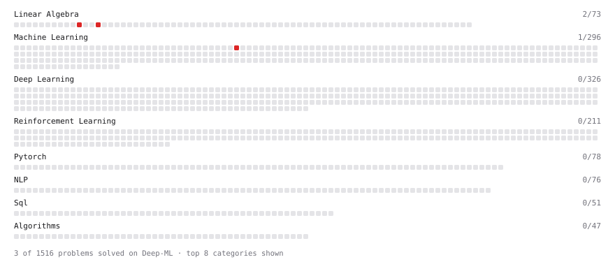

# Deep-ML

My machine learning practice from [Deep-ML](https://www.deep-ml.com). Every solution here was written by hand.

**2** solved · 2 problems · 0 labs · 0 math

[**Browse the interactive portfolio**](https://Unsone.github.io/deep-ml/) to replay this filling in over time.

## Problems

| | Difficulty | Solved | |
| --- | --- | --- | --- |
| [Singular Value Decomposition (SVD) of 2x2 Matrix](https://www.deep-ml.com/problems/12) | hard | 2026-10-08 | [solution](problems/0012-singular-value-decomposition-svd-of-2x2-matrix) |
| [Train Softmax Regression with Gradient Descent](https://www.deep-ml.com/problems/105) | hard | 2026-10-07 | [solution](problems/0105-train-softmax-regression-with-gradient-descent) |

---

_This file is regenerated by Deep-ML on every push._
